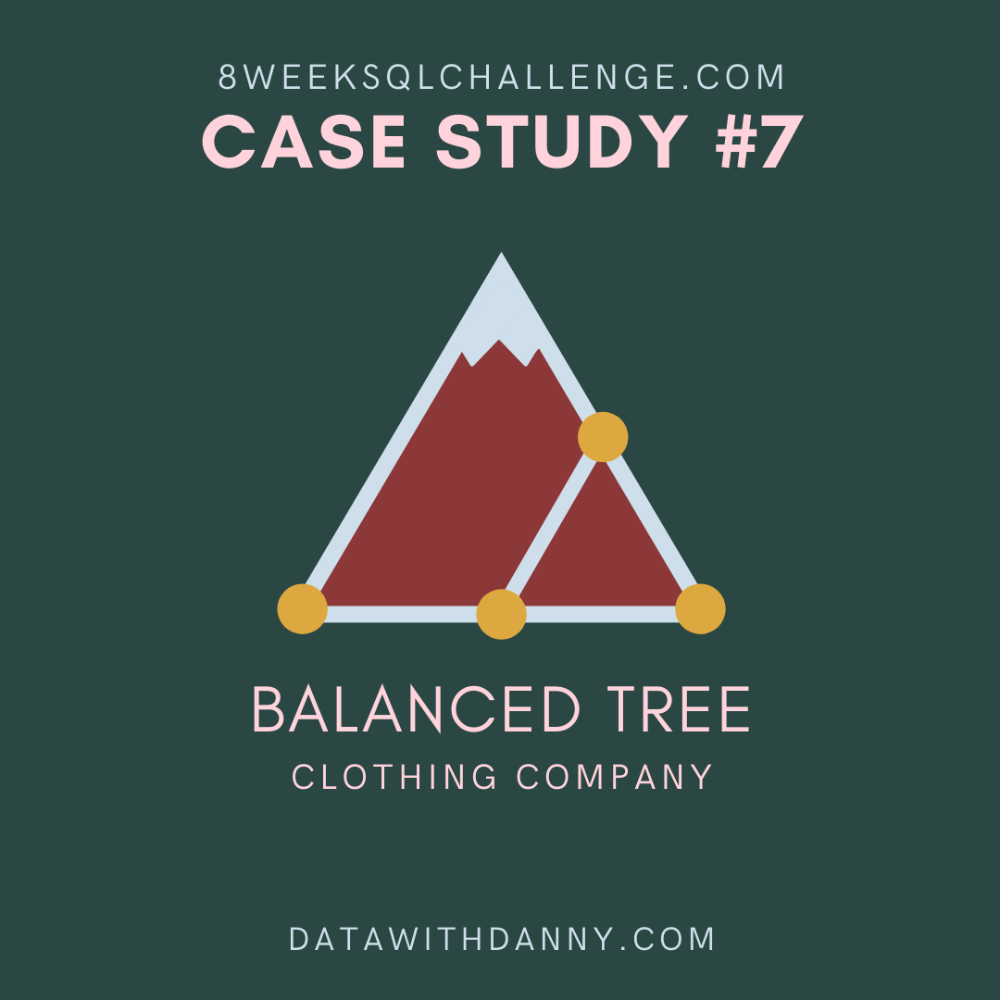

# Case Study
This project soloves Danny's SQL Case Study #7.

    

Balanced Tree Clothing Company prides themselves on providing an optimised range of clothing and lifestyle wear for the modern adventurer!

Danny, the CEO of this trendy fashion company has asked you to assist the team’s merchandising teams analyse their sales performance and generate a basic financial report to share with the wider business.

See full problem [here](case_study_problem.md).

See sql script [here](sql_cs7.sql).

See sql output [here](sql_solutions.md).

# Data Modeling & Dashboard Pipeline

Workflow

dbt models:

1. Create database balanced_tree in Postgres with tables:
- sales
- product_details

2. Connect Postgres with dbtCore, create models:
- base_sales from balanced_tree.sales table
- base_product_details from balanced_tree.product_details
- dim_dates: date dimension table
- stg_sales from base_sales, base_product_details,  dim_dates
These models will available as Views/ Table in Postgres

3. Connect Postgres with Power BI, datasource: stg_sales

4. Create Dashboard
Download dashboard [here](balanced_tree_clothing_dashboard.pbix).